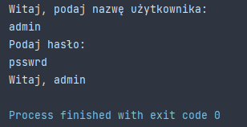

# PROGRAMOWANIE-OBIEKTOWE-JAVA
Nauka programowania obiektowego w języku Java

## Table of contents
* [General info](#general-info)
* [Technologies](#technologies)
* [IDE](#ide)

## General info
Ten projekt ma na celu przybliżenie oraz nauczenie tego, czym jest programowanie obiektowe przy użyciu języka Java w wersji Java Standard Edition 15

## Technologies
Projekt stworzono przy pomocy:
**Java Standard Edition 15**

## IDE
Cały projekt napisano przy pomocy:
Intellij IDEA Ultimate Edition w wersji 2021.1.1
Wraz z pomocnymi pluginami:
Nazwa pluginu | Zastosowanie
------------ | -------------
Rainbow Brackets | Kolorowanie nawiasów w celu efektywniejszej pracy i łatwiejszej nawigacji
Nord| Motyw w ciemnych odcieniach chłodnego niebieskiego w celu zapobiegnięcia szybkiego zmęczenia oczu

## Screenshots

